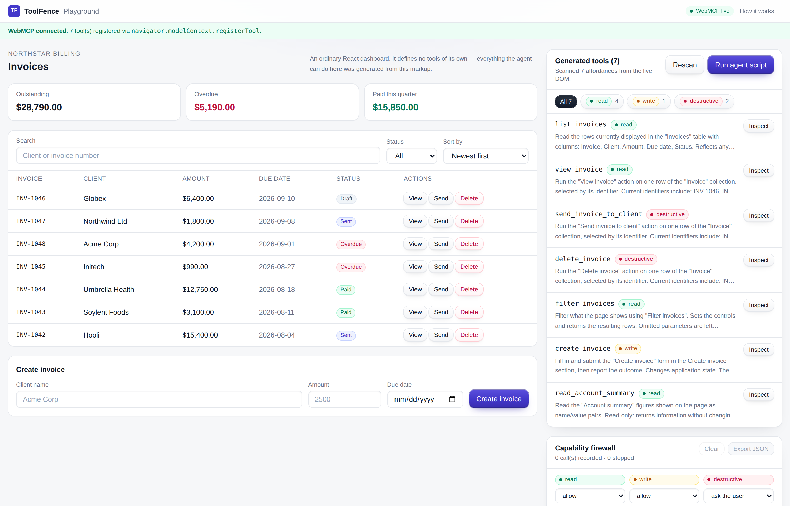
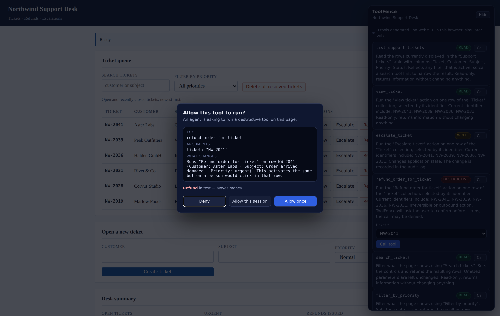
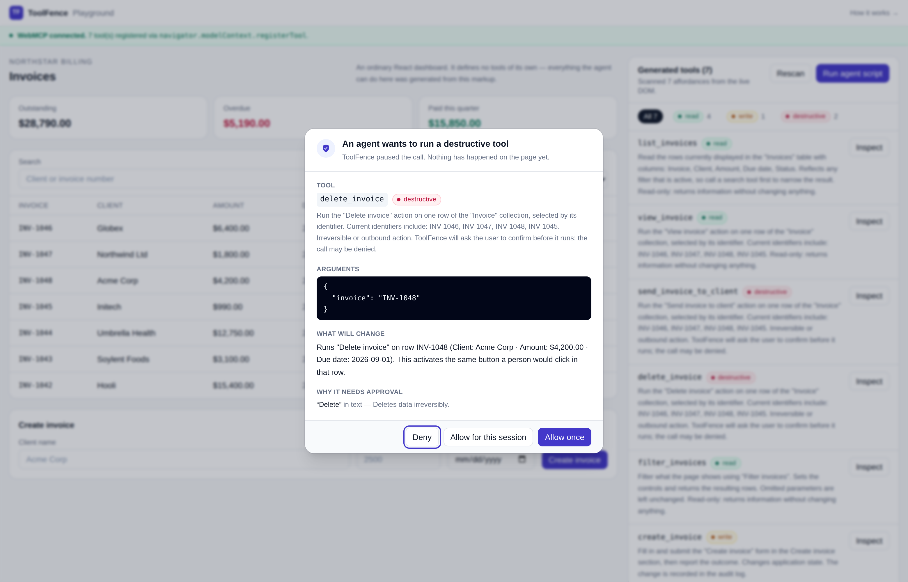
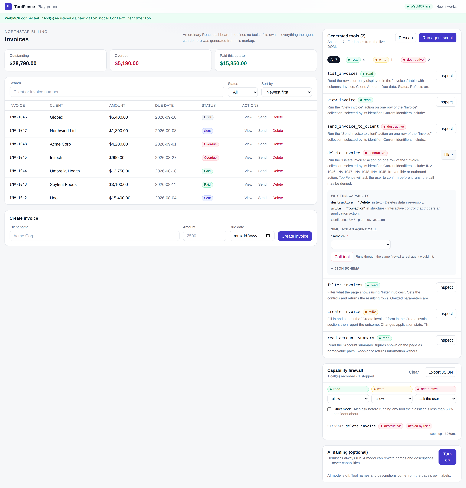

# ToolFence

**Turn any web app into WebMCP tools — and never let a dangerous tool run without the user's consent.**

ToolFence reads a page's accessibility tree, generates working WebMCP tools at runtime, and puts every
generated tool behind a capability firewall that classifies it as `read`, `write` or `destructive` and
stops the destructive ones at a consent dialog.

**[Live demo →](https://toolfence-omega.vercel.app/playground)** ·
**[On a page we didn't write →](https://toolfence-omega.vercel.app/foreign)** · no API key, no
sign-in, works in an ordinary browser.



---

## The problem

WebMCP lets a site publish tools that an agent can call. Two things stand in the way of that actually
happening. First, every tool has to be written by hand. A modest dashboard — a search box, a status
filter, a table, a create form, three buttons per row — is a day of writing names, JSON Schemas,
handlers, and then keeping all of it in sync as the UI changes. That work has to be finished before an
agent can do anything at all, which is why almost no site exposes tools today.

Second, the moment tools become cheap to publish, a new hazard appears. A page that exposes
`search_invoices` will also expose `delete_invoice`, `send_invoice_to_client` and `pay_now`, and WebMCP
has no opinion about the difference. The agent sees a flat list of callable functions. A misread
instruction, an ambiguous pronoun, or a prompt-injected page is then one tool call away from deleting a
record or emailing a client. The user finds out afterwards, if at all. Generation without a safety
layer does not make WebMCP more useful — it makes it more dangerous.

ToolFence solves both halves at once: the generator removes the cost of publishing tools, and the
firewall makes it safe to publish them.

---

## How it works

```
                          ┌──────────────────────────────┐
   any web page  ────────▶│ scan(document)               │  pure function, no DOM writes
                          │  roles · aria-* · <label>    │
                          │  semantic tags · never class │
                          └──────────────┬───────────────┘
                                         │ ScanResult
                          ┌──────────────▼───────────────┐
                          │ generate()                   │  tool name + description
                          │  Candidate -> ToolSchema     │  + JSON Schema arguments
                          └──────────────┬───────────────┘
                                         │ ToolSchema[]
                          ┌──────────────▼───────────────┐
                          │ classify()  RISK_SIGNALS     │  read / write / destructive
                          │  records every signal fired  │  + confidence + rationale
                          └──────────────┬───────────────┘
                                         │
                     ┌───────────────────┴────────────────────┐
                     │                                        │
              read / write                              destructive
                     │                                        │
                     │                         ┌──────────────▼─────────────┐
                     │                         │ consent modal              │
                     │                         │  tool · literal arguments  │
                     │                         │  · which row changes       │
                     │                         └──────┬──────────────┬──────┘
                     │                          allow │              │ deny
                     └────────────────┬───────────────┘              │
                                      │                              ▼
                          ┌───────────▼────────────┐   "Blocked by user. Tool
                          │ binder: drive the DOM  │    requires explicit consent."
                          │  native setters+events │
                          └───────────┬────────────┘
                                      │
                         every call ──▶ AuditLog (time, tool, args, decision)
                                      │
                          navigator.modelContext.registerTool(...)
```

The demo app **contains no ToolFence code**. `apps/web/components/InvoiceApp.tsx` is an ordinary React
dashboard — no tool definitions, no registration calls, no hooks. A `MutationObserver` in
`useToolFence.ts` is the only connection between them, so when a row is deleted or an invoice is
created, the tool list regenerates on its own. That is the point of the project: this works on a page
that has never heard of WebMCP.

### One tool per action, not one tool per row

A naive scanner turns a 200-row table with three buttons per row into 600 tools. ToolFence groups
buttons whose accessible names collapse to the same action once the row's own identifiers are stripped
(`"Delete invoice INV-1048"` → `"Delete invoice"`), and emits **one** `delete_invoice` tool that takes
the row identifier as a parameter. The identifier column is discovered from `<th scope="row">`.

---

## On a page we didn't write

A demo that only works on its author's own app proves very little, so ToolFence ships with a second
demo it has no relationship with. `apps/web/public/demo-sites/helpdesk.html` is a **Northwind Support
Desk**: static HTML, no React, no Tailwind, hand-written CSS, a different domain, and — grep it — no
mention of ToolFence anywhere in the file.

**[Open `/foreign`](https://toolfence-omega.vercel.app/foreign)**, press **Inject ToolFence**, and a
`<script>` is appended to that document at runtime, exactly the way the bookmarklet on the same page
does it on a site neither of us has seen. Nine tools appear, generated from markup written for humans:

| Tool | Capability | Why |
|---|---|---|
| `list_support_tickets`, `read_desk_summary` | `read` | Return information |
| `search_tickets`, `filter_by_priority`, `view_ticket` | `read` | Change what is displayed, not what is stored |
| `escalate_ticket`, `create_ticket` | `write` | Change state, recoverably |
| `refund_order_for_ticket` | `destructive` | Moves money |
| `delete_all_resolved_tickets` | `destructive` | Irreversible |

Six tickets are in that table and there is still exactly one `refund_order_for_ticket`, taking the
ticket id as a parameter. Nothing in the risk lexicon was tuned for support tickets or refunds; the two
tools that can cost the user something are the two that stop at the consent dialog.



`packages/core/test/foreign-page.test.ts` runs the same injectable entry point against that exact file
in jsdom, so the claim on this page is checked by CI rather than by a screenshot.

### Take it to a site of your own

`/foreign` carries a bookmarklet — drag it to the bookmarks bar, open any accessible dashboard, click
it. It loads `toolfence.js` (48 kB, no dependencies, built by `npm run build:inject`), which mounts the
panel in a shadow root so the host page's CSS and ToolFence's cannot reach each other. The shadow root
is also why the panel's own buttons never become tools: `scan()` does not cross that boundary.

Sites that send a strict `script-src` Content-Security-Policy will refuse the injection. That is the
browser doing its job — for those, ToolFence belongs in the page, as `packages/core` on an import.

---

## Run it locally

```bash
git clone https://github.com/alekseyrm1-debug/hackathon.git toolfence
cd toolfence
npm install

npm run dev          # http://localhost:3000  → /playground, and /foreign
npm test             # 46 Vitest tests against a jsdom page
npm run typecheck    # tsc --noEmit for both packages
npm run build:inject # bundles the injectable public/toolfence.js
npm run build        # production build (runs build:inject first)
```

No API key is needed for anything above. The optional AI naming pass is the only feature that wants
one, and the app is fully functional without it.

## Try it with a real agent

**In a browser with WebMCP** (ChatGPT's browser, or Chrome with the flag below):

1. Open `/playground`. The top banner turns green and names the registration API it found.
2. Ask the agent: *"Show me the overdue invoices, then delete the oldest one."*
3. `filter_invoices` and `list_invoices` run silently — they are `read`.
4. `delete_invoice` stops at the consent dialog. Deny it, and the agent receives
   `Blocked by user. Tool requires explicit consent.`

**In Chrome without WebMCP:**

1. Optionally enable `chrome://flags/#enable-webmcp-testing` and restart the browser.
2. Without it the banner stays grey and everything else still works: the page is scanned, tools are
   generated and classified, and the audit log records calls.
3. Press **Run agent script** to replay a three-step agent session, or open any tool and press
   **Call tool** to invoke it with your own arguments. Both paths go through the same firewall.



---

## Architecture

### `packages/core` — framework-free TypeScript, no dependencies

| File | What it does |
|---|---|
| `types.ts` | Every type in the pipeline: `Candidate`, `ToolSchema`, `Capability`, `BoundTool`, `AuditEntry`, `FirewallPolicy`. Defined up front so each stage has one vocabulary. |
| `dom.ts` | Accessible-name computation, stable CSS paths, visibility checks, and the native-setter write that React-controlled inputs actually notice. |
| `scanner.ts` | `scan(document) -> ScanResult`. A pure function: no global state, no DOM writes. Finds collections, row actions, filter bars, forms, summary lists and standalone buttons. |
| `generator.ts` | `ScanResult -> ToolSchema[]`. Names each tool, writes an agent-readable description, emits a JSON Schema, and builds a declarative `ExecutionPlan`. |
| `firewall.ts` | `RISK_SIGNALS` (the whole risk lexicon in one constant), `classify()`, and the `Firewall` class: policy resolution, consent gate, session grants, audit log. |
| `binder.ts` | `ToolSchema -> executable handler`. Re-resolves elements at call time, so React re-renders cannot leave a stale reference. Also produces the "what will change" sentence the modal shows. |
| `register.ts` | The **only** file that touches `navigator.modelContext`. A spec change should not reach any other file. |
| `enrich.ts` | Optional AI naming pass. Can rewrite names and prose only — capability, classification and execution plan are copied from the heuristic tool. |
| `index.ts` | Public exports plus `runPipeline()`, which runs scan → generate → bind → register in one call. |
| `overlay.ts` | The panel and consent dialog for pages that are not ours: plain DOM in a shadow root, no framework. |
| `standalone.ts` | `start()` — the pipeline plus a `MutationObserver`, for injection into an arbitrary document. |
| `browser-entry.ts` | Bundle entry. Exposes `window.ToolFence` and starts on load; built to `apps/web/public/toolfence.js`. |

### `apps/web` — Next.js 15 App Router, Tailwind v4

| File | What it does |
|---|---|
| `app/page.tsx` | Landing page: the claim, the problem, the pipeline, how to try it. |
| `app/playground/page.tsx` | The demo: dashboard + inspector side by side, plus the scripted agent run. |
| `app/foreign/page.tsx` | The third-party proof: the helpdesk in a frame, an Inject button, and the bookmarklet. |
| `public/demo-sites/helpdesk.html` | A page ToolFence has no relationship with. Static, framework-free, zero ToolFence references. |
| `app/api/enrich/route.ts` | AI mode. Returns **501** when `OPENAI_API_KEY` is unset, so the client falls back cleanly. |
| `components/InvoiceApp.tsx` | The demo product. Plain React. Contains no ToolFence code of any kind. |
| `components/useToolFence.ts` | The React binding: one firewall per page, `MutationObserver`-driven rescans, consent prompt wiring. |
| `components/ToolInspector.tsx` | Generated tools, the signals behind each capability, and the call simulator. |
| `components/ConsentModal.tsx` | The consent gate. Escape fails closed, exactly like Deny. |
| `components/AuditLogPanel.tsx` | Per-capability policy, strict mode, session grants, and the exportable call record. |

### How a capability is decided

Every signal lives in `RISK_SIGNALS` in `firewall.ts`. Each one names a pattern, the sources it may
match against (button text, `aria-label`, `role`, `type`, `<form method>`), a weight, and a rationale
that is shown verbatim to the user. Structural facts add their own signals: a control that only filters
a view scores toward `read`; a form or an action button scores toward `write`.

Destructive signals are **forcing**: if `delete`, `pay`, `send`, `cancel`, `transfer` or `approve`
matches anywhere, the tool is destructive regardless of the read/write score. Being wrong in that
direction costs one extra click. Being wrong the other way costs the user's data.

`Strict mode` (in the firewall panel) additionally prompts for any tool the classifier is less than 50%
confident about — the fail-safe setting for pages the heuristics do not understand.



---

## Limitations (honest list)

- **Heuristics need accessible markup.** A page built from unlabelled `<div onclick>` produces few
  candidates. That is a deliberate trade: ToolFence rewards accessibility rather than guessing from
  class names, which are meaningless on a Tailwind site. Unnamed controls are reported in
  `ScanResult.skipped` instead of being silently dropped.
- **The risk lexicon is English.** `RISK_SIGNALS` is one constant and is easy to extend, but a page in
  another language will currently classify most actions as `write` with low confidence. Strict mode is
  the mitigation; proper localisation is not implemented.
- **Classification is a heuristic, not a proof.** A button labelled "Process" that charges a card will
  be classified `write`. The forcing rule and strict mode reduce this, but a page can still mislead the
  classifier. ToolFence raises the floor; it is not a guarantee.
- **Consent is per tool, not per argument.** "Allow for this session" grants the whole tool. There is no
  "allow deleting drafts but not paid invoices" — argument-level policy is designed for in the types but
  not implemented.
- **Same-document only.** The scanner does not cross iframe or shadow-root boundaries. (Injecting
  *into* a frame works — that is what `/foreign` does — but one injection scans one document.)
- **Injection is blocked by a strict CSP.** The bookmarklet appends a `<script>`, so a site sending a
  restrictive `script-src` will refuse it, silently, from the browser's side. Nothing can be done about
  that from a bookmarklet: on such a site ToolFence has to be imported into the page instead.
- **The WebMCP surface is a moving target.** `register.ts` supports both `registerTool` and
  `provideContext` and degrades to a working in-page simulator when neither exists, but it is written
  against a draft API and may need one file's worth of edits when the spec settles.
- **AI mode is untested against a live key in this repository.** The route, the client, the 501
  fallback and the "capabilities are never rewritten" rule are all implemented and type-checked, but the
  author had no API key available while building, so the model round-trip itself has not been run.
  Heuristic mode is the default and needs nothing.
- **No persistence.** The audit log lives in memory for the session. Exporting it is a button; shipping
  it to a server is not implemented.

---

## Licence

MIT. See [LICENSE](LICENSE). Use it, fork it, vendor `packages/core` into your own app — it has no
dependencies and no framework coupling.
